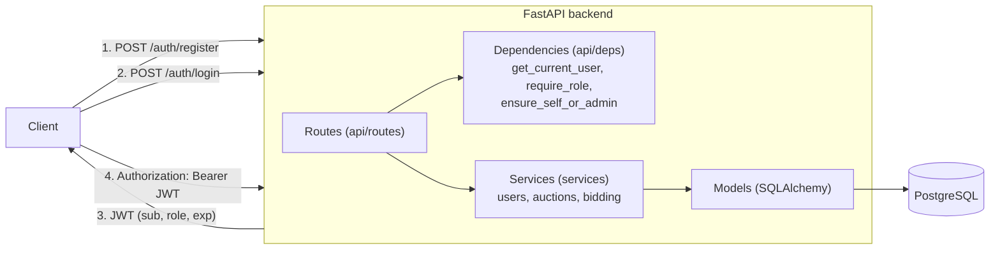
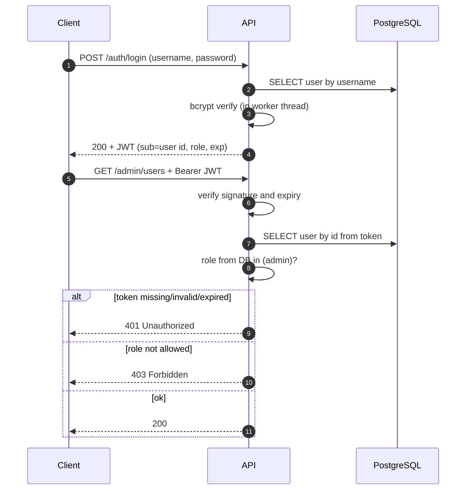

# Лабораторна №2: користувачі, ролі та розмежування доступу

Цей документ описує прийняті архітектурні рішення та їх обґрунтування.

## 1. Загальна схема

Шари відповідають за різне:

| Шар | Каталог | Відповідальність |
|---|---|---|
| Маршрути | `app/api/routes` | HTTP: приймають запит, викликають залежності й сервіси, формують відповідь |
| Залежності | `app/api/deps.py` | Автентифікація (хто ти?) та авторизація (що тобі можна?) |
| Схеми | `app/schemas` | Валідація вхідних даних і форма відповідей (пароль ніколи не потрапляє у відповідь) |
| Сервіси | `app/services` | Бізнес-логіка без залежності від HTTP: реєстрація, ставки, закриття аукціону |
| Моделі | `app/models` | Структура таблиць |
| Безпека | `app/core/security.py` | Хешування паролів, створення й перевірка JWT |

## 2. Потік автентифікації

## 3. Матриця доступу

| Ендпоінт | Анонім | Користувач (`user`) | Адміністратор (`admin`) |
|---|---|---|---|
| `GET /health`, `/health/db` | так | так | так |
| `POST /auth/register`, `/auth/login` | так | так | так |
| `GET /artifacts`, `/auctions`, `/auctions/{id}`, `/auctions/{id}/bids` | так | так | так |
| `GET /users/me`, `GET /home` | 401 | так | так |
| `GET /home/user` | 401 | так | 403 |
| `GET /home/admin` | 401 | 403 | так |
| `GET/PATCH /users/{id}`, `POST /users/{id}/deposit`, `GET /users/{id}/bids` | 401 | лише свій id, інакше 403 | будь-який id |
| `POST /auctions/{id}/bids` | 401 | так | 403 |
| `POST /artifacts`, `POST /auctions`, `POST /auctions/{id}/close` | 401 | 403 | так |
| `GET /admin/users`, `GET /admin/stats`, `PATCH /admin/users/{id}` | 401 | 403 | так |
| `WS /ws/auctions/{id}?token=` | відхилено | так | так |

## 4. Обрані рішення та обґрунтування

### 4.1. JWT Bearer-токен замість серверних сесій
- **Чому.** У першій лабораторній ми заклали *stateless backend*: інстансів застосунку має бути можливо додавати за балансувальником. Сесії вимагали б спільного сховища (Redis) вже зараз, а JWT перевіряється кожним інстансом самостійно за підписом.
- **Ціна рішення.** Токен складно відкликати до завершення терміну дії. Тому він короткоживучий (60 хв, `ACCESS_TOKEN_EXPIRE_MINUTES`), а роль і статус акаунта читаються з БД на кожен запит (див. 4.3). Refresh-токени й чорний список у Redis залишено для наступних робіт.

### 4.2. Ролі: enum `admin` / `user` у таблиці `users`
- Одна роль на користувача покриває вимогу завдання і не ускладнює модель. Тип `user_role` створений на рівні PostgreSQL (`ENUM`), тому БД не прийме некоректне значення.
- Нову роль (наприклад, `moderator`) додають у enum і в `require_role(...)`, решта коду не змінюється.

### 4.3. Роль береться з БД, а не з токена
Токен містить claim `role` лише для клієнта. Сервер йому не довіряє: `get_current_user` на кожен запит читає користувача з БД. Наслідки, що покриті тестами:
- підроблений токен з `role: admin` не дає прав;
- підвищення або пониження ролі діє негайно, без перевипуску токена;
- заблокований адміністратором користувач одразу втрачає доступ (403), хоча токен ще «живий».

Ціна: один запит за первинним ключем на кожен автентифікований запит. Для довгоживучих WebSocket-з'єднань це не підходить, тому там перевіряється лише підпис і термін токена.

### 4.4. Паролі: bcrypt у окремому потоці
- bcrypt навмисно повільний, тож брутфорс дорогий, а сіль генерується автоматично і зберігається всередині хешу.
- Хешування виконується через `asyncio.to_thread`, щоб ~100 мс роботи CPU не блокували event loop. Для високонавантаженої системи це принципово.
- Для неіснуючого користувача виконується фіктивна перевірка хешу, а відповідь однакова («невірний логін або пароль»). Так за відповіддю та часом не можна дізнатись, які логіни існують.
- Обмеження 72 байти (межа bcrypt) перевіряється у схемі, щоб довгий пароль не обрізався мовчки.
- Пароль ніколи не повертається в API: у `UserOut` такого поля немає.

### 4.5. Реєстрація створює лише звичайних користувачів
- Схема `UserRegister` має `extra="forbid"`: спроба передати `"role": "admin"` дає 422 (захист від mass assignment).
- Адміністратора створює людина з доступом до сервера командою `python -m app.cli create-admin`. Так адмінський доступ неможливо отримати через публічний API. Це відповідає опціональності реєстрації адмінів у завданні.
- Ім'я користувача й e-mail нормалізуються до нижнього регістру, щоб `Alice` і `alice` не були різними акаунтами.

### 4.6. Два рівні контролю доступу
1. **Вертикальний (за роллю):** залежність `require_role(...)`. Невідповідна роль дає 403.
2. **Горизонтальний (за власником, захист від IDOR):** функція `ensure_self_or_admin`. Звичайний користувач працює лише з ресурсами свого `id`, інакше 403.

Дрібні, але важливі деталі:
- Перевірка прав виконується **до** пошуку об'єкта. Тому звичайний користувач отримує 403 і для чужого, і для неіснуючого id, і не може перебрати id, щоб з'ясувати, хто зареєстрований. Адміністратору повертається чесний 404.
- Авторизація виконується **до** валідації тіла запиту: користувач без прав отримає 403, а не 422, який розкрив би структуру приватного API.
- Поля `role`, `balance`, `is_active` не приймаються в профільних запитах (`extra="forbid"`), змінювати роль і блокувати користувача може лише адміністратор через `/admin`.

### 4.7. Код 401 і код 403
- **401 Unauthorized:** система не знає, хто ти (немає токена, він недійсний, прострочений, підписаний чужим ключем, користувача не існує). Відповідь містить заголовок `WWW-Authenticate: Bearer`.
- **403 Forbidden:** система знає, хто ти, але тобі не можна (не та роль, чужий ресурс, акаунт заблоковано).

### 4.8. Мінімально життєздатний продукт (MVP)
- Адміністратор створює артефакти й аукціони та закриває їх. Користувач поповнює баланс і робить ставки.
- Статус аукціону (`scheduled` / `active` / `finished`) **обчислюється за часом**, а не зберігається, тому не потрібен фоновий процес, який «перемикав» би статуси. Явно зберігається лише закриття адміністратором.
- Правила ставки: аукціон активний, перша ставка не нижча за стартову ціну, кожна наступна строго вища за поточну, вистачає балансу, не можна перебивати самого себе.
- Адміністратори не роблять ставок: вони організовують торги (403).
- Читання каталогу та аукціонів відкрите, як у будь-якому аукціонному сервісі.

### 4.9. Захист від race condition при ставках
Проблема з першої лабораторної тепер розв'язана в коді. Використано **оптимістичне блокування** через колонку `auctions.version`:

1. Обидві конкурентні ставки читають аукціон з версією N.
2. Обидві виконують `UPDATE ... WHERE id = :id AND version = N`.
3. PostgreSQL пропускає лише одну. Друга отримує `StaleDataError`, перечитує актуальну ціну й повторює перевірку (до 3 спроб): або її ставка все ще вища й проходить, або відхиляється як надто низька.

Ставка і оновлення ціни лежать в одній транзакції, тому «загубленої» найвищої ставки бути не може. Це підтверджено:
- автотестом на 10 одночасних ставок;
- скриптом `scripts/bid_race_demo.py` на справжньому PostgreSQL: 20 одночасних запитів дали 5 прийнятих ставок строго зростаючої послідовності, найвища збереглася.

Альтернативи (`SELECT ... FOR UPDATE`, атомарні Lua-скрипти в Redis, черга на лот) залишаються предметом порівняльних експериментів у наступних роботах. Поповнення балансу зроблено атомарним `UPDATE ... SET balance = balance + :x` (без «втраченого оновлення»).

### 4.10. WebSocket з автентифікацією
- Підключення вимагає токен (`/ws/auctions/{id}?token=...`), без нього рукостискання відхиляється.
- Канал **лише для читання**: сервер розсилає події `new_bid` та `auction_closed`, а ставки клієнти роблять через REST. Це усуває можливість підробити ціну повідомленням у сокет (у першій лабораторній сокет просто ретранслював будь-який текст). Єдине повідомлення від клієнта, яке обробляється, це `ping`.
- Токен у query-параметрі може потрапити в логи проксі. Для навчального проєкту це прийнятно, для продакшену краще передавати його першим повідомленням або через subprotocol.

## 5. Що свідомо не реалізовано (і чому)

| Обмеження | Коментар |
|---|---|
| Ліміт спроб входу (rate limiting) | Потребує Redis; планується разом із кешуванням |
| Refresh-токени, відкликання токенів | Потребує сховища; наразі короткий термін дії токена |
| Підтвердження e-mail, відновлення пароля | Поза межами завдання |
| Списання коштів з переможця | Потрібна модель резервування коштів; наразі баланс лише перевіряється при ставці |
| HTTPS | Виконується на рівні Nginx (наступні роботи) |
| Ставки через WebSocket | Розглядається у роботах про навантаження |

## 6. Тестування

Запуск: `pytest`. Тести використовують тимчасову SQLite-базу, тому Docker не потрібен.

| Файл | Що перевіряє |
|---|---|
| `test_auth.py` | 401 для анонімів на всіх захищених маршрутах, реєстрація, вхід, помилки входу, підроблені/прострочені токени |
| `test_roles.py` | 403 для звичайного користувача в адмін-панелі, окрема домашня сторінка кожної ролі, негайна дія зміни ролі та блокування |
| `test_idor.py` | Заборона доступу до чужого профілю, балансу й ставок, відсутність перебору id, mass assignment |
| `test_auctions.py` | Правила ставок, закриття аукціону, оптимістичне блокування, 10 одночасних ставок, розсилка події |
| `test_websocket.py` | Відхилення сокета без токена, менеджер підключень |
